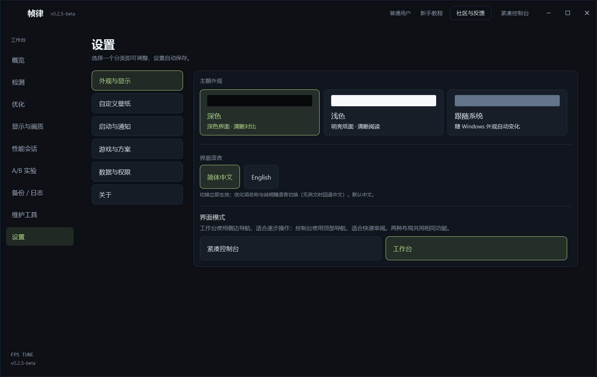
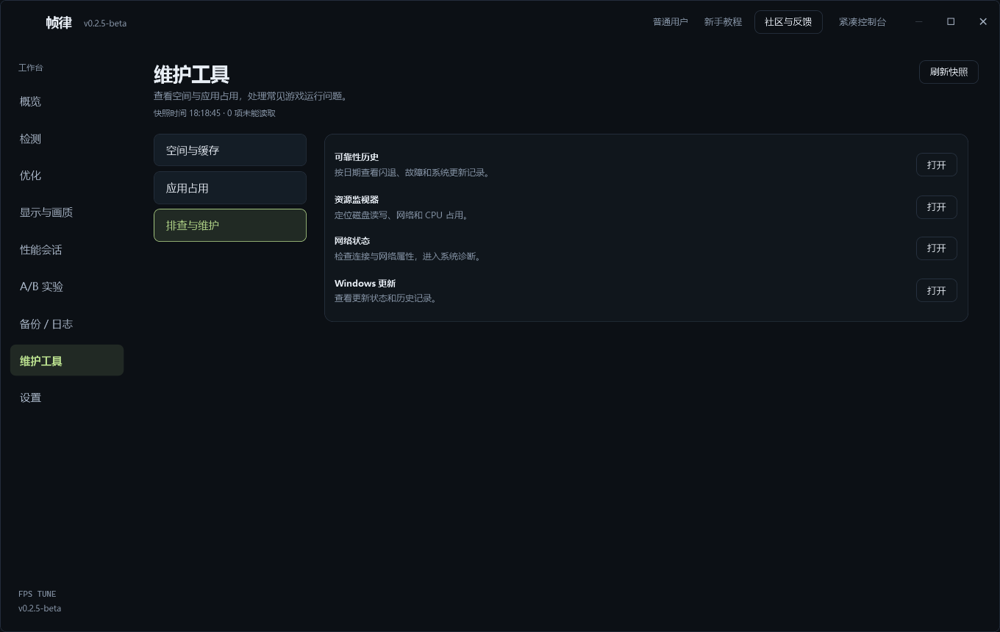

# FPS Tune · fps-tune

[简体中文](README.md) · [English](README.en.md) · [Official downloads](https://github.com/jidekaixin2dian/fps-tune/releases/latest)

Windows system tuning and performance measurement: detect → review → apply → measure → restore.
Available through a desktop interface and command-line tools.

## 0.2.4: a major update

0.2.4 brings substantial changes across the interface, tuning options and recovery workflow:

- **Redesigned interface**: studio and compact layouts, six settings categories, custom wallpaper, and inline tutorial, community and update cards.
- **Expanded tuning**: multiple-game path detection, 11 ICC presets, AC CPU controls and shader-cache preview and cleanup.
- **Everyday maintenance**: drive space, process memory snapshots, storage cleanup, startup apps and troubleshooting shortcuts.
- **Recovery and updates**: improved backups for system, driver and color settings, optional updates with download verification, and complete license texts in the app and packages.

**0.2.5 refines this major update** with consistent small-text weights and item-title sizes, theme transitions and a branded installer that always lets you choose the destination.

**0.2.6 fixes DLSS preset saving and privilege messages**: elevated processes no longer repeatedly offer elevation, and saving handles a missing NVIDIA driver database directory. Model selection writes only the preset. Saving and restoration reload the driver settings to verify the result, retaining the original backup on failure. Applying K should report that it was saved and independently verified; restart the game and enable DLSS to confirm its in-game effect.

**0.2.7 further fixes DLSS K and driver 3D apply failures**: when an old backup differs from the current driver values, it preserves the old record and backs up the current values before applying. Driver 3D choices are read on the UI thread and saved in one batch. Refreshes retain failure details and the preset selected for retry. Saving reloads the driver settings to verify the result, and restoration still checks external changes. The reporting user has confirmed success with this fix.

## Versions and downloads

Current version: **[v0.2.7-beta](https://github.com/jidekaixin2dian/fps-tune/releases/tag/v0.2.7-beta)**. The 1.x line is unmaintained.

Download from this repository's [Releases](https://github.com/jidekaixin2dian/fps-tune/releases/latest).
The application targets Windows 10/11 x64; your OS version must satisfy .NET 10 requirements.

**Download the [EXE installer, FpsTune-Setup-0.2.7.exe](https://github.com/jidekaixin2dian/fps-tune/releases/download/v0.2.7-beta/FpsTune-Setup-0.2.7.exe), first.** It includes the .NET runtime and guides you through installation. The portable ZIP is for users who already have the required runtime and want to run without installation.

| File | Purpose |
|---|---|
| `FpsTune-Setup-<version>.exe` | **Recommended download**; installer including the .NET runtime |
| `FpsTune-Portable-<version>.zip` | Portable application requiring [.NET 10 Windows Desktop Runtime](https://dotnet.microsoft.com/download/dotnet/10.0) |
| `SHA256SUMS-v<version>.txt` | Compare with `Get-FileHash -Algorithm SHA256 <file>` |

The application is currently unsigned, so Windows may show an unknown publisher. Verify the source and checksum before running. A checksum verifies matching content; it does not replace a publisher signature.
From 0.2.4, portable and installer packages include complete LICENSE and third-party notices. Full texts are also available under Settings → About → Open-source licenses and CLI `-License`.

The branded installer lets you choose a destination, including during reinstallation; your existing directory remains the default. In-app updates show release notes and download progress, then open the installer after verification.

## Interface preview

| Studio | Settings |
|---|---|
|  |  |

| Maintenance | Detection |
|---|---|
|  |  |

## Current features

- **Studio and compact console layouts**, dark/light themes with smooth transitions, shared selection controls and a local image as the application wallpaper. Low-spec mode or disabled Windows animations switches themes immediately.
- **Detection and system tuning**: 38 catalog items with current state, privileges, restart flags and side effects. Memory compression control is unavailable, with legacy restoration retained. Balanced includes 16 items; safe-only includes 4 without elevation. New AC CPU energy preference and maximum-state controls start unchecked.
- **Multiple games**: recognizes Delta Force, CS2, VALORANT, APEX, PUBG, Call of Duty, Fortnite, Warframe and other listed clients; scans shared libraries and accepts a manually chosen EXE. Path detection does not establish performance or anti-cheat compatibility for every title.
- **Display and quality**: per-game NVIDIA DRS / DLSS settings, primary-display digital vibrance, 11 generated ICC presets or a custom `.icc` / `.icm`, and restoration of the original association. ICC works in color-managed applications; some games ignore it.
- **GPU name experiment**: sets the NVIDIA Windows `DeviceDesc` to GTX 1050 Ti and backs up the original description. It does not change DXGI hardware IDs, driver capabilities or GPU performance. Whether a game uses that name needs measurement.
- **Organized settings**: appearance, wallpaper, startup and notifications, games and profiles, data and permissions, and About. Settings save automatically; wallpaper has a rounded preview and compact opacity slider.
- **Everyday maintenance**: fixed-drive free space and the top 8 process working sets, refreshed on demand. Open Windows storage cleanup, installed apps, Task Manager, startup apps, reliability history, Resource Monitor, network and update settings. Snapshots stay in the current page and are not uploaded.
- **Cache maintenance**: preview the current user's DirectX / NVIDIA shader caches and confirm cleanup. Busy or changed files are skipped. Deleted cache files cannot be restored; regeneration may cause temporary stutter.
- **Performance sessions and A/B**: local CPU, RAM, GPU, VRAM and frame-time recording, exports and comparisons. Real FPS capture requires official PresentMon.
- **Inline guidance**: tutorial, community feedback and optional update cards appear in the main window's lower-right corner and can be collapsed or closed.
- **Backups and recovery**: one inventory covers system settings, game driver profiles, ICC and vibrance, with individual results and failures.

The application adjusts system or driver configuration without modifying game files or injecting into game processes. Results depend on hardware, drivers, games and scenes; compare on the same machine.

## Quick start

Run `FpsTune.exe`, select a game and scan its current settings. Review the selected optimization items before applying them. Start with a small selection and measure whether to keep it.
The application starts as `asInvoker`; operations needing elevation offer a restart as administrator.

<details>
<summary>Command-line usage (advanced)</summary>

```powershell
.\FpsTune.exe -Detect -Json
.\FpsTune.exe -Detect -Game "C:\Games\Game.exe" -Json
.\FpsTune.exe -Apply -Preset balanced -Json       # review and agree first
.\FpsTune.exe -Apply -Items game-mode,gpu-pref -Game "C:\Games\Game.exe" -Json
.\FpsTune.exe -ListRestore -Json
.\FpsTune.exe -Restore -Json
.\FpsTune.exe -Version
.\FpsTune.exe -License
```

The catalog marks 28 items for administrator privileges and 16 for restart.
CLI Apply / Restore begins work immediately and should be used within the agreed scope.
The AI-assistant procedure is in [SKILL.md](SKILL.md).

</details>

## Recovery and measurement boundaries

Supported setting writes save original values first. An unreadable original blocks that item.
Recovery targets the recorded setting, preserving backups and reporting conflicts when external changes, device/driver changes or insufficient legacy metadata prevent verification.
Import preserves records; it does not authorize applying another machine's or a previous Windows installation's backups.
Disabling hibernation can be reversed by re-enabling it, but deleted hibernation contents and the original file type/size are outside recovery scope. Cache deletion is also irreversible.

```powershell
.\FpsTune.exe -Experiment -Baseline -Json
.\FpsTune.exe -Experiment -Test -Group group-1 -Json
.\FpsTune.exe -Experiment -Report -Json
# Add -Simulate to every command for a rehearsal using separate simulated records.
```

Install official PresentMon yourself (for example, `winget install Intel.PresentMon.Console`). Its signature and publisher are checked before capture.
A/B uses fixed hardware, game, graphics settings and route, with at least 3 valid samples and CV ≤ 0.05. A P99 regression above 3% prevents keeping the candidate; other thresholds appear in the recorded decision.
This is a rule-based decision, not proof of statistical significance. Simulated records do not establish real FPS gains. Failed rollback is reported and its recovery records remain available.

## Updates and privacy

Startup checks this repository's GitHub Releases by default. Disable it in Settings or check manually.
New versions show an inline card; you control downloading and installing. Updates are optional, with no automatic installation.
A third-party file host is unnecessary. Downloads use official HTTPS release assets and the same release's SHA256 manifest.

Hardware readings, game paths, backups, sessions and logs stay under `%LocalAppData%\FpsTune` and are not automatically uploaded.
Update requests disclose the network connection's IP and a `FpsTune` User-Agent to GitHub, without hardware, game lists or logs. GitHub and QQ process visits and community information under their own service rules.
Diagnostic exports are manual and may contain device, setting and operation records; inspect them before sharing. Preserve needed backups before deleting local records.

## Community and feedback

Join the **FPS 帧律 developer community** to discuss usage, report issues, suggest features and discuss the developer's other open-source projects.

- **QQ group: 659528489**
- **Bugs and feature requests:** [GitHub Issues](https://github.com/jidekaixin2dian/fps-tune/issues)

Use, learning and sharing are welcome. Follow the open-source license when redistributing and, where practical, credit the original project.
The group is for community discussion and does not promise real-time support. Do not post vulnerabilities or private information publicly.
Private vulnerability reporting is currently disabled on this repository. Start with a contact request containing no exploit details or personal information, then share details through a private channel supplied by the maintainer.

## License and redistribution

The project's own code uses the [MIT License](LICENSE). The historical `Copyright (c) 2026 delta-force-tune contributors` notice is retained; renaming the project does not replace it.
MIT permits use, modification, copying, redistribution, sublicensing and commercial use subject to preserving the copyright and license notice. Crediting the project source is a recommendation, not an added license condition. Modified distributions may use another name while clearly identifying their origin.
Third-party terms are listed in [THIRD-PARTY-NOTICES.txt](THIRD-PARTY-NOTICES.txt); the project's MIT license does not replace them.

Game and hardware brands identify supported targets, without implying vendor sponsorship or endorsement. The software is provided under the MIT text and promises no fixed FPS gain.
