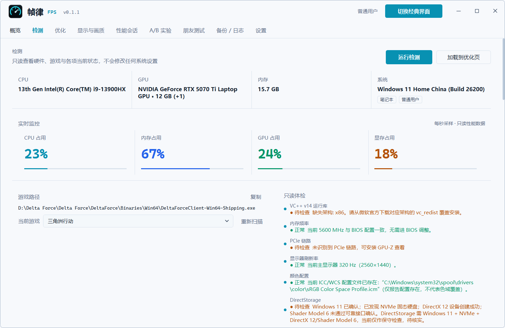
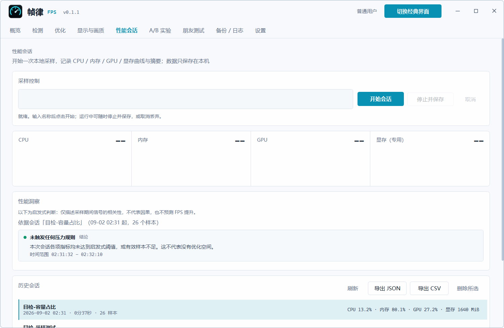

# FPS 帧律 · fps-tune

[简体中文](README.md) · [English](README.en.md) · [下载最新版](https://github.com/jidekaixin2dian/fps-tune/releases/latest)

面向 Windows 玩家的**系统层**帧率调校台：检测 → 解释 → 确认 → 执行 → 还原，全流程可逆、结论可验证。
C# WPF + .NET 10，`FpsTune.exe` 同时是无头 CLI（命令行 / AI Agent 入口）。


> 版本线 0.1 Beta：功能可用，仍在收敛期，破坏性变更会写进 Release Notes。
> 1.x（含 1.6.X）**已停止维护**，冻结分支 `legacy/1.x`；请改用 0.1 Beta。

## 它只改 Windows，不碰游戏

| 会做 | 不会做 |
|---|---|
| 改注册表 / 电源计划 / 服务启动类型 / 启动配置 | 修改游戏目录里的任何文件 |
| 每次写入前备份原值（含"原本不存在"状态） | 注入进程、读游戏内存 |
| 按游戏定位 EXE，只做路径级适配 | 与反作弊交互 |
| 本机采样，结论来自实测 | 关引导虚拟化 |
| 逐项或一键还原到备份值 | 遥测上报、后台自动下载 |

不针对特定游戏——《三角洲行动》《CS2》《无畏契约》《APEX》《PUBG》《使命召唤》等都能用。
游戏定位从卸载注册表和常见安装目录查找，不读取运行中进程的路径；
未识别的游戏可用 `-Game` 手动指定 EXE。

## 下载

去 [Releases](https://github.com/jidekaixin2dian/fps-tune/releases/latest) 挑一个（Windows 10/11 x64）：

| 产物 | 说明 |
|---|---|
| `FpsTune-Setup-<版本>.exe` | Inno Setup 安装包，自带 .NET 运行时，**推荐** |
| `FpsTune-Portable-<版本>.zip` | 解压即用，需已装 [.NET 10 Windows Desktop Runtime](https://dotnet.microsoft.com/download/dotnet/10.0) |
| `SHA256SUMS-v<版本>.txt` | 校验清单，配合 `Get-FileHash -Algorithm SHA256 <文件>` |

程序**未做代码签名**（个人开源项目的常态），首次运行 SmartScreen 会提示未知发布者，
选「更多信息 → 仍要运行」即可。更新检查只在你在设置页主动点击时访问 `api.github.com`，
下载前会先征求同意并核验 SHA256。

## 界面

| 检测：只读体检 + 实时监控 | 优化：预设 / 分类 / 逐项说明与副作用 |
|---|---|
|  |  |

| 性能会话：本机采样与启发式洞察 | A/B 实验：基线 + 三候选组 + 规则判定 |
|---|---|
|  |  |

另有：备份 / 日志（每次写入的审计）、
设置（主题 / 托盘 / 全局热键 Ctrl+Alt+F / 按游戏自动应用方案）。
支持深色、浅色与跟随系统，无边框自绘标题栏，首次启动有引导。

## 快速开始

### GUI

安装或解压后运行 `FpsTune.exe`。先在「检测」页跑一次（只读，安全），
再到「优化」页选预设、逐项审阅，勾选同意后执行。改坏了点「还原全部」。

### 命令行

`FpsTune.exe` 带参数即进入无头模式（不弹窗口，输出到 stdout，退出码 0/1）：

```powershell
.\FpsTune.exe -Detect -Json                       # 只读检测
.\FpsTune.exe -Detect -Game <游戏exe路径> -Json    # 手动指定未识别的游戏
.\FpsTune.exe -Apply -Preset balanced -Json       # 应用预设（先征得用户同意）
.\FpsTune.exe -Apply -Items id1,id2 -Json         # 只应用指定项
.\FpsTune.exe -Restore -Json                      # 还原全部
.\FpsTune.exe -ListRestore -Json                  # 查看可用备份
.\FpsTune.exe -Version                            # 版本与构建提交
```

需要管理员的项在非提权终端里会明确报错（exe 以 asInvoker 运行，不自动弹 UAC）。
33 项中 22 项需要管理员、13 项需要重启才完全生效；「均衡」预设含 27 项。

### AI Agent

```text
先执行 git clone https://github.com/jidekaixin2dian/fps-tune.git，
然后读取克隆目录里的 SKILL.md，严格按其中的流程帮我优化帧率。
```

`SKILL.md` 是唯一操作流程入口，内含硬性红线：先解释再执行、不承诺帧数、必须可还原。

## 用数据说话，而不是承诺

「性能会话」在本机采样 CPU / 内存 / GPU / 显存曲线，数据只存本机，可导出 JSON / CSV、可两次会话并排比较。
「A/B 实验」把这条链闭合：

```powershell
# 基线（游戏运行，固定地图 / 画质 / 路线）
.\FpsTune.exe -Experiment -Baseline -Json
.\FpsTune.exe -Experiment -Test -Group group-1 -Json
.\FpsTune.exe -Experiment -Report -Json
```

判定是规则化的：平均帧率 / 1% low / P99 帧时间 / 卡顿次数对比基线，
**有可测收益才保留，否则自动还原**；样本不足或基线不稳（CV > 0.05）时直接不出结论。
真实采样需要官方 PresentMon，请自行安装（`winget install Intel.PresentMon.Console`），
工具不会替你下载或运行任何安装器；先用 `-Simulate` 可以安全试跑整条流程。

所以这里**不写"稳定 +30 FPS"**：结果取决于你的硬件、驱动和游戏设置，有争议的项默认不勾选。

## 为什么做这个

市面上同类工具采用专有 EULA，禁止修改与再分发，改了什么也不透明。
本项目以公开的功能清单为参考，代码与文档全部自写（clean-room），MIT 宽松许可，
33 个优化项与预设统一定义在 `catalog/catalog.json`——你可以直接读完它到底改哪些键值。

## 架构

```
catalog/catalog.json          优化项与预设的唯一数据源（33 项 + 均衡/保守预设）
FpsTune.Wpf/
  Core/                       OptimizationCatalog / NativeOptimizationEngine /
                              BackupService / DetectionService / ExperimentRunner
  Services/                   主题 / 设置 / 脚本定位 / 进程封装 / CLI 宿主 / 更新检查
  Views/                      WPF 视图（控制台与经典两套布局）
FpsTune.Wpf.Tests/            单元测试（含 catalog 一致性守卫）
installer/                    Inno Setup 打包
docs/                         现状文档（HANDOFF / ROADMAP / README 索引）
  dev/                        计划与开发纪律；archive/  1.x 历史存档（不代表现状）
```

GUI 与 CLI 共用同一份 C# 引擎与数据，加载即校验。
新增或修改一个优化项：编辑 `catalog/catalog.json`，再在 `NativeOptimizationEngine`
（apply/revert）与 `DetectionService`（状态读取）各加一个 case 分支——
catalog 一致性测试会强制条目与实现同步，漏改直接测试失败。

版本与产品标识的单源是 `Directory.Build.props` 的 `VersionPrefix` / `VersionSuffix`；
正式发布脚本从最终干净提交读取完整 SHA，嵌入 `InformationalVersion` 并用本机文件版本信息核验。

## 安全与隐私

- 每次可逆改动先写入 `%LocalAppData%\FpsTune\backup`；还原按项进行，
  原本不存在的值会被删除而不是留残值；空 / 损坏备份自动归档为 `.stale`。
- 所有改动留有 JSON 审计记录，「备份 / 日志」页可查。
- 无遥测、无统计上报。唯一的网络访问是你主动触发的更新检查。
- 需要管理员的项在普通权限下失败并说明原因，不会静默跳过。

## 开发

```powershell
dotnet build FpsTune.Wpf/FpsTune.Wpf.csproj -c Release    # 需要 .NET 10 SDK
.\FpsTune.Wpf\bin\Release\net10.0-windows\FpsTune.exe

dotnet test FpsTune.Wpf.Tests/FpsTune.Wpf.Tests.csproj -c Release
.\FpsTune.Wpf\bin\Release\net10.0-windows\FpsTune.exe -Detect -Json   # 无副作用冒烟
```

文档入口：
- **`docs/README.md`** —— 文档总索引：现状文档 vs 1.x 历史存档，按角色给出"先读什么"
- `AGENTS.md` —— 接手开发的 AI 代理入口（硬纪律、危险操作清单、工作区地图）
- `CONTRIBUTING.md` —— 人类贡献者最短路径
- `RELEASE.md` —— 发版流程；`docs/ROADMAP.md` —— 产品方向与五条红线

Issues 开放：报 bug、提优化项、指出某项解释不清，都欢迎。

## 许可

MIT，详见 LICENSE。代码完全原创，与任何现有工具无衍生关系。

如果它帮你省了逐个翻注册表的时间，点个 Star 是对这个项目最直接的推广。
