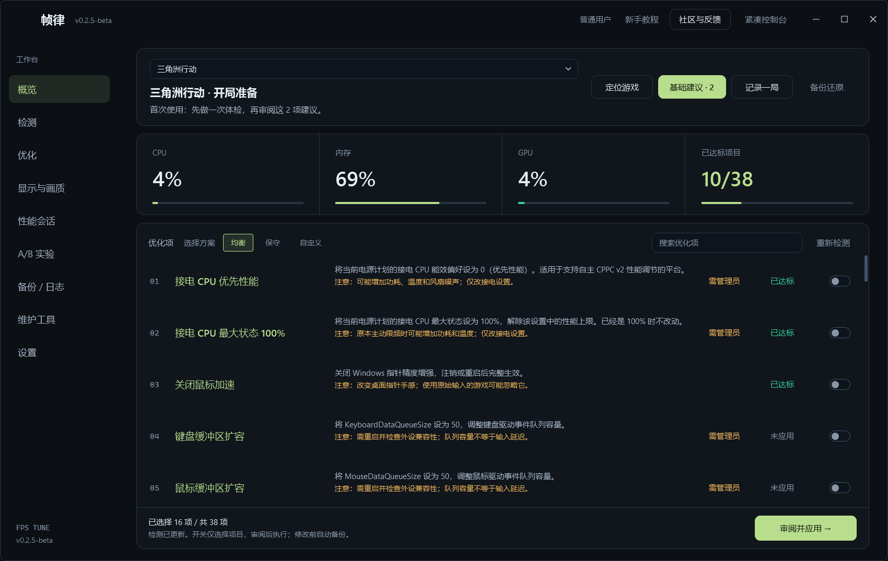
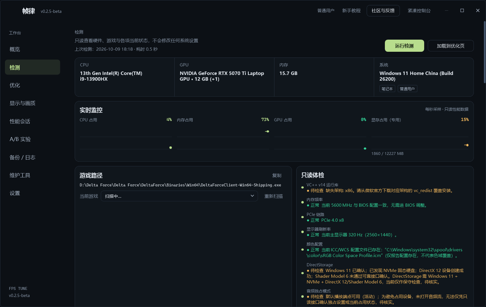
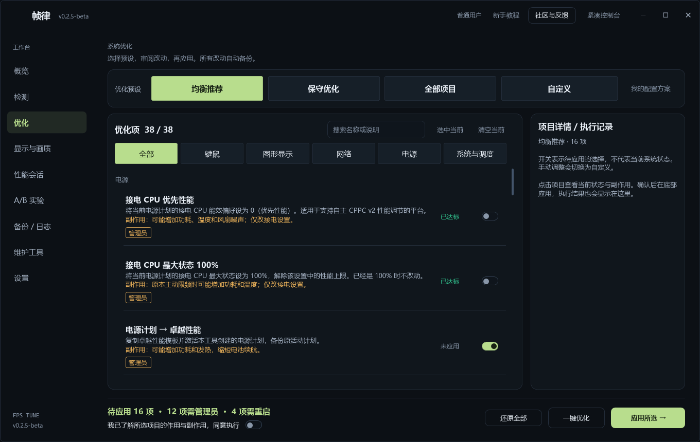
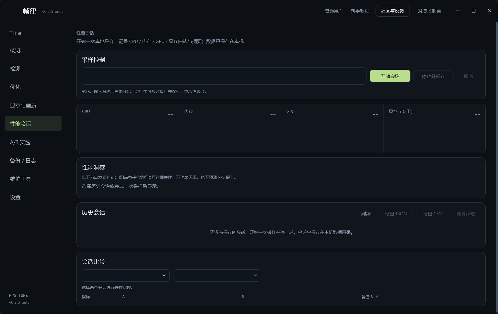
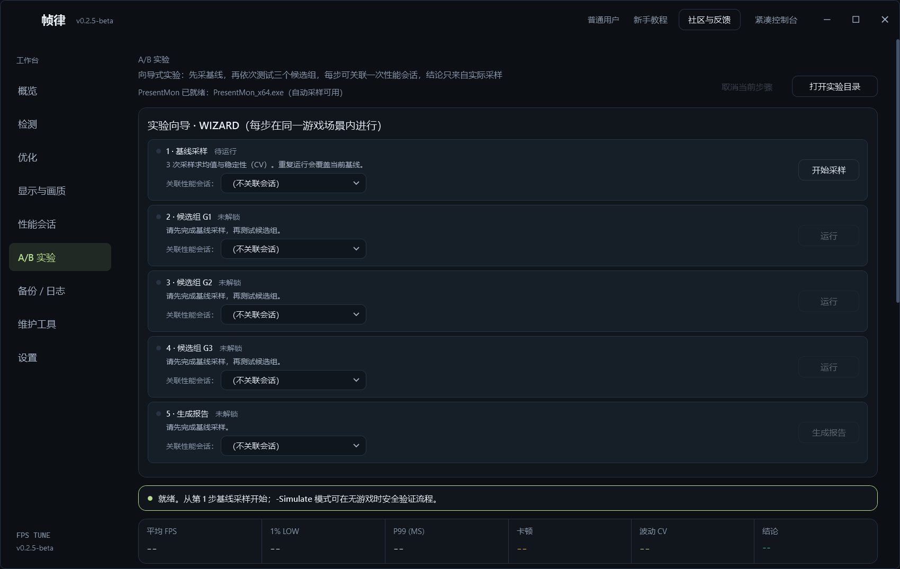

# FPS 帧律 · fps-tune

[简体中文](README.md) · [English](README.en.md) · [下载最新版](https://github.com/jidekaixin2dian/fps-tune/releases/latest)

面向 Windows 玩家的**系统层**帧率调校台：检测 → 解释 → 确认 → 执行 → 还原，全流程可逆、结论可验证。
C# WPF + .NET 10，`FpsTune.exe` 同时是无头 CLI（命令行 / AI Agent 入口）。




> 版本线 0.2 Beta（0.2.0 起进入实测闭环阶段）：功能可用，仍在收敛期，破坏性变更会写进 Release Notes。
> 1.x（含 1.6.X）**已停止维护**，冻结分支 `legacy/1.x`；请改用 0.2 Beta。

## 它只改 Windows，不碰游戏

| 会做 | 不会做 |
|---|---|
| 改注册表 / 电源计划 / 服务启动类型 / 启动配置 | 修改游戏目录里的任何文件 |
| 每次写入前备份原值（含"原本不存在"状态） | 注入进程、读游戏内存 |
| 按游戏定位 EXE，只做路径级适配 | 与反作弊交互 |
| 本机采样，结论来自实测 | 关引导虚拟化 |
| 逐项或一键还原到备份值 | 遥测上报、后台自动下载 |

不针对特定游戏——《三角洲行动》《CS2》《无畏契约》《APEX》《PUBG》《使命召唤》等都能用。
游戏定位从卸载注册表和常见安装目录查找，不读取运行中进程的路径；
未识别的游戏可用 `-Game` 手动指定 EXE。

## 下载

**已发布 [v0.2.3-beta](https://github.com/jidekaixin2dian/fps-tune/releases/tag/v0.2.3-beta)**（2026-10-07）：按页面与窗口可见性启停实时预览，录制和预览共用采样；GPU 批量读取、
会话帧时间流式保存、历史只保留摘要，减少重复工作和常驻明细。修复逐游戏判定隔离、
旧备份 ZIP 漏导、方案名称显示、游戏路径保存及二维码复制；经典概览启动恢复已选游戏。
旧模拟实验仅在时间与指标精确匹配来源时校正显示，不在读取时改写原向导文件。
此次更新减少重复采样，游戏帧率与资源占用仍因设备和场景而异，不承诺固定收益。

去 [Releases](https://github.com/jidekaixin2dian/fps-tune/releases/latest) 挑一个（Windows 10/11 x64）：

| 产物 | 说明 |
|---|---|
| `FpsTune-Setup-<版本>.exe` | Inno Setup 安装包，自带 .NET 运行时，**推荐** |
| `FpsTune-Portable-<版本>.zip` | 解压即用，需已装 [.NET 10 Windows Desktop Runtime](https://dotnet.microsoft.com/download/dotnet/10.0) |
| `SHA256SUMS-v<版本>.txt` | 校验清单，配合 `Get-FileHash -Algorithm SHA256 <文件>` |

程序**未做代码签名**（个人开源项目的常态），首次运行 SmartScreen 会提示未知发布者，
选「更多信息 → 仍要运行」即可。更新检查只在你在设置页主动点击时访问 `api.github.com`，
下载前会先征求同意并核验 SHA256。

## 界面

| 检测：只读体检 + 实时监控 | 优化：预设 / 分类 / 逐项说明与副作用 |
|---|---|
|  |  |

| 性能会话：本机采样 + 瓶颈判定 + 启发式洞察 | A/B 实验：基线 + 候选组 / 自定义组 + 规则判定 |
|---|---|
|  |  |

**多游戏（0.2.1 起）**：添加多个游戏，概览页下拉即切——每个游戏独立的检测快照、
优化状态与实测结论；绑定了方案的游戏进程一启动，自动切到该游戏上下文。

**实测闭环（0.2.0 起）**：A/B 页可把优化页当前勾选的优化项作为**自定义组**整组实测
（基线采样 → 自动应用（带独立备份）→ 再采样 → 规则判定保留或自动还原；只勾 1 项即单项深测；
需重启的项会被明确拒绝——重启后基线失效，对比不成立）。结论沉淀在本机并落到界面上：
优化项带「本机实测 +x.x% FPS」徽标（有数据才显示）、A/B 页有结论列表与**一键导出 Markdown
实测报告**（含测试条件与口径说明）。性能会话同步记录全程**帧率**（平均 / 1% low / p99 / 卡顿，
需官方 PresentMon），洞察卡给出**瓶颈判定**（GPU 受限 / CPU 受限 / 未呈现单侧，启发式口径）。

另有：**显示与画质**（四个页签：DLSS 预设覆盖 / 振动与 ICC——数字振动滑条 + 应用你自己的
`.icc` / `.icm` 校色文件 / 驱动 3D 按游戏写入 / 建议与清单——按厂商生成的驱动内手动设置
清单与驱动版本建议；页签带当前状态徽标，不点进去也能看到每组状态，全部只读指引可还原）、
备份 / 日志（每次写入的审计 + 备份文件状态列表 + **改动总览**——原值 vs 当前实时状态、
支持备份导出/导入，重装系统一键找回优化前状态）、
A/B 页 PresentMon 前置可用性检测（缺了给官方安装命令，不代为安装）、
设置（主题 / 托盘 / 全局热键 Ctrl+Alt+F / 按游戏自动应用方案 / 诊断包导出与一键反馈）、
带真实阶段进度的启动画面与按需加载的页面。
支持深色、浅色与跟随系统，无边框自绘标题栏；经典概览在首次启动提供「检测 → 优化」引导，
控制台概览则是一键采纳「基础建议」（游戏模式 / 后台录制 / 显卡偏好三项，不挑游戏）。

## 快速开始

### GUI

安装或解压后运行 `FpsTune.exe`。先在「检测」页跑一次（只读，安全），
再到「优化」页选预设、逐项审阅，勾选同意后执行。改坏了点「还原全部」。

### 命令行

`FpsTune.exe` 带参数即进入无头模式（不弹窗口，输出到 stdout，退出码 0/1）：

```powershell
.\FpsTune.exe -Detect -Json                       # 只读检测
.\FpsTune.exe -Detect -Game <游戏exe路径> -Json    # 手动指定未识别的游戏
.\FpsTune.exe -Apply -Preset balanced -Json       # 应用预设（先征得用户同意）
.\FpsTune.exe -Apply -Items id1,id2 -Json         # 只应用指定项
.\FpsTune.exe -Restore -Json                      # 还原全部
.\FpsTune.exe -ListRestore -Json                  # 查看可用备份
.\FpsTune.exe -Version                            # 版本与构建提交
```

需要管理员的项在非提权终端里会明确报错（exe 以 asInvoker 运行，不自动弹 UAC）。
36 项中 25 项需要管理员、16 项需要重启才完全生效；「均衡」预设含 29 项。

### AI Agent

```text
先执行 git clone https://github.com/jidekaixin2dian/fps-tune.git，
然后读取克隆目录里的 SKILL.md，严格按其中的流程帮我优化帧率。
```

`SKILL.md` 是唯一操作流程入口，内含硬性红线：先解释再执行、不承诺帧数、必须可还原。

## 用数据说话，而不是承诺

「性能会话」在本机采样 CPU / 内存 / GPU / 显存曲线与全程帧率，数据只存本机，可导出 JSON / CSV、可两次会话并排比较。
「A/B 实验」把这条链闭合：

```powershell
# 基线（游戏运行，固定地图 / 画质 / 路线）
.\FpsTune.exe -Experiment -Baseline -Json
.\FpsTune.exe -Experiment -Test -Group group-1 -Json
.\FpsTune.exe -Experiment -Report -Json
```

判定是规则化的：平均帧率 / 1% low / P99 帧时间 / 卡顿次数对比基线，
**有可测收益才保留，否则自动还原**；样本不足或基线不稳（CV > 0.05）时直接不出结论。
真实采样需要官方 PresentMon，请自行安装（`winget install Intel.PresentMon.Console`），
工具不会替你下载或运行任何安装器；先用 `-Simulate` 可以安全试跑整条流程。

所以这里**不写"稳定 +30 FPS"**：结果取决于你的硬件、驱动和游戏设置，有争议的项默认不勾选。

## 为什么做这个

市面上同类工具采用专有 EULA，禁止修改与再分发，改了什么也不透明。
本项目以公开的功能清单为参考，代码与文档全部自写（clean-room），MIT 宽松许可，
36 个优化项与预设统一定义在 `catalog/catalog.json`——你可以直接读完它到底改哪些键值。

## 安全与隐私

- 每次可逆改动先写入 `%LocalAppData%\FpsTune\backup`；还原按项进行，
  原本不存在的值会被删除而不是留残值；空 / 损坏备份自动归档为 `.stale`。
- 所有改动留有 JSON 审计记录，「备份 / 日志」页可查。
- 无遥测、无统计上报。唯一的网络访问是你主动触发的更新检查。
- 需要管理员的项在普通权限下失败并说明原因，不会静默跳过。

## 反馈

欢迎在 Issues 报告问题或提出功能建议。

## 许可

MIT，详见 LICENSE。代码完全原创，与任何现有工具无衍生关系。

如果它帮你省了逐个翻注册表的时间，点个 Star 是对这个项目最直接的推广。
